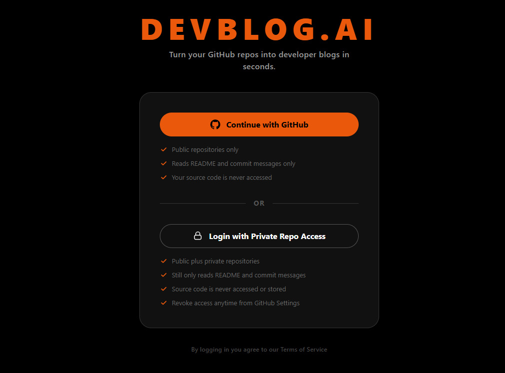
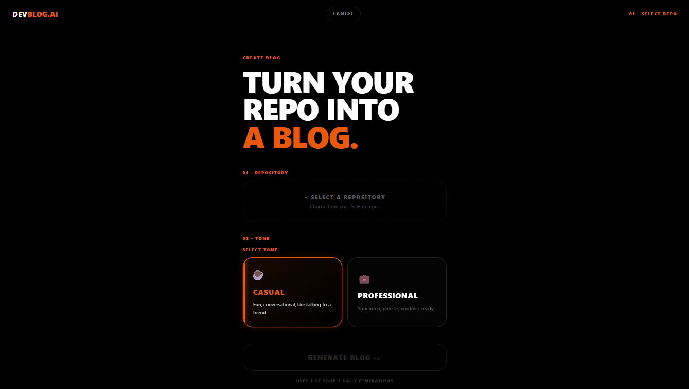
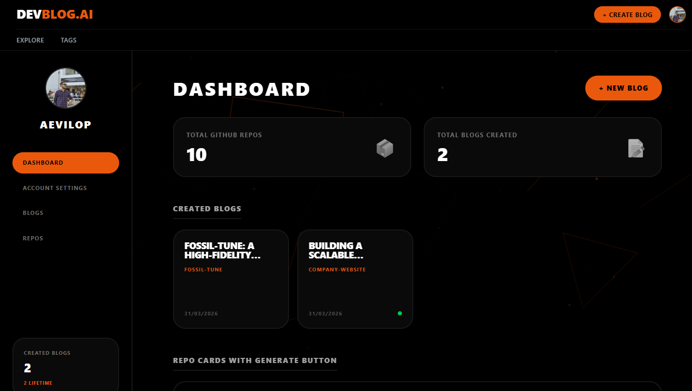

<p align="center">
  
  
  
  
  
  
</p>

<h1 align="center">
  DEV<span>BLOG.AI</span>
</h1>

<p align="center">
  <strong>Turn any GitHub repository into a polished developer blog post — in under 60 seconds.</strong>
</p>

<p align="center">
  <a href="https://dev-ai-blog.vercel.app">🔗 Live App</a> &nbsp;·&nbsp;
  <a href="https://dev-ai-blog-backend.onrender.com/api-docs">📖 API Docs (Swagger)</a> &nbsp;·&nbsp;
  <a href="https://github.com/AEVILOP">👤 Author</a>
</p>

---

## The Problem

Developers build incredible things but rarely write about them. Writing a blog post from scratch takes hours — understanding the project context, structuring the narrative, finding the right tone. Most side projects never get documented.

**DevBlog.AI solves this by reading your repository's README, commit history, and metadata — then generating a structured, human-sounding developer blog that you can edit and publish instantly.**

This is not a wrapper around ChatGPT. The entire pipeline — from GitHub data extraction to commit quality scoring to prompt engineering to AI fallback chains — is custom-built.

---

## Screenshots

<table>
  <tr>
    <td width="50%">
      
      <p align="center"><strong>Tiered GitHub OAuth</strong><br/>Public-only or full repo access — your choice</p>
    </td>
    <td width="50%">
      
      <p align="center"><strong>Generate Flow</strong><br/>Select repo → pick tone → one click generation</p>
    </td>
  </tr>
  <tr>
    <td width="50%">
      
      <p align="center"><strong>Split-Pane Editor</strong><br/>Edit fields on the left, live preview on the right</p>
    </td>
    <td width="50%">
      
      <p align="center"><strong>Dashboard</strong><br/>Manage drafts, published blogs, and repo cards</p>
    </td>
  </tr>
</table>

---

## What Makes This Different

Most AI projects call an API and display the result. Here's what's actually engineered under the hood:

### 🧠 Intelligent Commit Scoring Pipeline
The system doesn't just dump commit messages into a prompt. It runs a **multi-signal scoring algorithm** that:
- Scores commits by prefix (`feat`, `fix`, `refactor` → high signal), keyword presence, message length, and position in the timeline (recent = higher weight)
- Filters noise patterns (merge commits, "typo" fixes, one-word messages) while preserving any noisy commit that still scored above threshold
- Deduplicates semantically similar messages
- Auto-selects the top 15 commits and reports a `qualityLevel` (`high` / `medium` / `low`) so the frontend can adapt its UI

### 🛡️ README Sanitization & Prompt Injection Defense
User READMEs are untrusted input. Before they reach the AI:
- Prompt injection patterns (`ignore previous instructions`, `you are now`, etc.) are stripped
- Template READMEs (Create React App boilerplate) are detected and rejected
- Markdown noise (images, links, HTML tags) is cleaned
- Content is sectioned by heading, scored for quality, and truncated at sentence boundaries — not mid-word
- README and commit data are wrapped in delimiters (`<README_START>`, `<COMMITS_START>`) with explicit instructions to treat them as untrusted data

### ⚡ Dual-AI Fallback Chain
- **Primary**: Groq (LLaMA 3.3 70B) — 14,400 free requests/day, near-instant inference
- **Fallback**: Google Gemini 1.5 Flash — kicks in automatically if Groq fails
- Both services fail → clean user-facing error, no crash
- AI output is parsed with self-healing JSON logic (strips markdown fences, fixes trailing commas, removes control characters)
- If output is too short (< 300 words), the system **retries automatically** with an explicit length enforcement prompt

### 🔒 12 Edge Cases Handled in One Controller
The `generateBlog` controller handles, in order:
1. Missing / invalid input validation
2. Concurrent request guard (two tabs → second request blocked via `isGenerating` flag)
3. Daily generation limit (10/day, auto-resets at midnight)
4. Per-blog regeneration cap (max 3)
5. Duplicate blog detection (same user + same repo)
6. Template README rejection
7. **Pending draft saved to DB _before_ calling AI** — if the tab closes mid-generation, the draft survives
8. Groq failure → automatic Gemini fallback
9. Both AI services fail → clean error
10. Malformed JSON response → self-healing parser
11. Output too short → retry with enforcement
12. On any error → always reset the `isGenerating` lock (prevents permanent lockout)

---

## Architecture

```
┌──────────────────────────────────────────────────────────────┐
│  FRONTEND (React 19 + Vite + Tailwind)                       │
│  Deployed: Vercel                                            │
│                                                              │
│  ┌──────────┐ ┌───────────┐ ┌──────────┐ ┌───────────────┐  │
│  │  Auth    │ │  GitHub   │ │  Editor  │ │  Blog Feed    │  │
│  │  Context │ │  Hooks    │ │  Layout  │ │  + Explore    │  │
│  └──────────┘ └───────────┘ └──────────┘ └───────────────┘  │
│       │             │             │              │           │
│       └─────────────┴─────────────┴──────────────┘           │
│                         │                                    │
│                    apiClient.js (Axios, withCredentials)      │
└─────────────────────────┬────────────────────────────────────┘
                          │  HTTPS (cookie-based sessions)
┌─────────────────────────┴────────────────────────────────────┐
│  BACKEND (Express 5 + Node.js)                               │
│  Deployed: Render                                            │
│                                                              │
│  Middleware Stack:                                            │
│  ┌─────────┐ ┌────────┐ ┌───────────┐ ┌──────────────────┐  │
│  │ Helmet  │→│  CORS  │→│ Sessions  │→│ Rate Limiters    │  │
│  │ (CSP)   │ │(dynamic│ │(MongoStore│ │ (global/ai/auth)  │ │
│  └─────────┘ │origins)│ │ 14d TTL) │ └──────────────────┘  │
│              └────────┘ └───────────┘                        │
│                                                              │
│  Routes:                                                     │
│  /api/auth    → GitHub OAuth (public + full scope)           │
│  /api/github  → Repos, README, Commits (with cache)         │
│  /api/ai      → Blog generation pipeline                    │
│  /api/blogs   → CRUD + publish toggle                       │
│  /api-docs    → Swagger UI                                   │
│                                                              │
│  Services:                                                   │
│  ┌─────────────┐  ┌──────────────┐  ┌────────────────────┐  │
│  │ githubSvc   │  │ readmeSvc    │  │ promptBuilder      │  │
│  │ (API + cache│  │ (sanitize +  │  │ (tone, data prio,  │  │
│  │  + scoring) │  │  score +     │  │  commit timeline,  │  │
│  │             │  │  section     │  │  injection defense) │  │
│  └──────┬──────┘  │  extraction) │  └────────┬───────────┘  │
│         │         └──────────────┘           │              │
│         │                              ┌─────┴──────┐       │
│         │                              │ groqSvc    │       │
│         │                              │ geminiSvc  │       │
│         │                              │ (fallback) │       │
│         │                              └────────────┘       │
│         │                                                    │
│  ┌──────┴─────────────────────────────────────────────────┐  │
│  │  MongoDB Atlas                                         │  │
│  │  Users: OAuth tokens, daily limits, commit cache,      │  │
│  │         pending draft refs, isGenerating lock           │  │
│  │  Blogs: structured JSON content, publish state,        │  │
│  │         isUnfinished flag, regeneration count           │  │
│  └────────────────────────────────────────────────────────┘  │
└──────────────────────────────────────────────────────────────┘
```

---

## Tech Stack

| Layer | Technology | Why |
|-------|-----------|-----|
| **Frontend** | React 19, Vite 7, Tailwind CSS 4 | Latest React with concurrent features; Vite for sub-second HMR; Tailwind for rapid UI |
| **Animations** | GSAP | WebGL-grade geometric background animation |
| **Forms** | React Hook Form | Minimal re-renders on the editor page |
| **Markdown** | react-markdown | Blog preview rendering |
| **Backend** | Express 5, Node.js | Express 5 async error handling, no `try/catch` wrappers needed for middleware |
| **Auth** | Passport.js + GitHub OAuth 2.0 | Two strategies: `github-public` (read:user) and `github-full` (+repo scope) |
| **Sessions** | express-session + connect-mongo | Cookie-based, cross-domain (SameSite=None), 14-day TTL, MongoStore persistence |
| **Database** | MongoDB Atlas + Mongoose 9 | Document model fits blog content perfectly; compound indexes for duplicate detection |
| **AI (Primary)** | Groq — LLaMA 3.3 70B Versatile | 14,400 req/day free tier, near-instant inference, best open-source writing quality |
| **AI (Fallback)** | Google Gemini 1.5 Flash | 1,500 req/day free, 1M token context, auto-fallback on Groq failure |
| **Security** | Helmet, express-rate-limit, sanitize-html | CSP headers, 3-tier rate limiting (global/AI/auth), HTML sanitization |
| **Docs** | Swagger (OpenAPI 3.0) | Auto-generated from JSDoc annotations, live at `/api-docs` |
| **Deploy** | Vercel (frontend) + Render (backend) | Zero-config deploys with environment parity |

---

## Project Structure

```
DevAIBlog/                          DevAIBlog-backend/
├── src/                            ├── src/
│   ├── app/                        │   ├── config/
│   │   ├── App.jsx                 │   │   ├── db.js
│   │   └── routes.jsx              │   │   ├── passport.js
│   ├── features/                   │   │   └── swagger.js
│   │   ├── auth/                   │   ├── controllers/
│   │   │   ├── AuthContext.jsx     │   │   ├── aiController.js
│   │   │   └── Login.jsx           │   │   ├── authController.js
│   │   ├── blog/                   │   │   ├── blogController.js
│   │   │   ├── hooks/useBlogs.js   │   │   └── githubController.js
│   │   │   └── pages/              │   ├── middleware/
│   │   │       ├── Home.jsx        │   │   ├── authMiddleware.js
│   │   │       ├── Explore.jsx     │   │   ├── errorHandler.js
│   │   │       └── BlogDetail.jsx  │   │   ├── rateLimiter.js
│   │   ├── editor/                 │   │   └── validateEnv.js
│   │   │   ├── components/         │   ├── models/
│   │   │   │   ├── BlogEditor.jsx  │   │   ├── Blog.js
│   │   │   │   ├── BlogLayout.jsx  │   │   └── User.js
│   │   │   │   ├── BlogPreview.jsx │   ├── routes/
│   │   │   │   ├── ToneSelector.   │   │   ├── aiRoutes.js
│   │   │   │   └── Regenerate...   │   │   ├── authRoutes.js
│   │   │   ├── hooks/useGenerate.  │   │   ├── blogRoutes.js
│   │   │   └── pages/CreateBlog.   │   │   └── githubRoutes.js
│   │   ├── github/                 │   ├── services/
│   │   │   ├── components/         │   │   ├── geminiService.js
│   │   │   │   ├── RepoCard.jsx    │   │   ├── githubService.js
│   │   │   │   └── RepoSelector.   │   │   ├── groqService.js
│   │   │   └── hooks/useGitHub.js  │   │   ├── promptBuilder.js
│   │   └── account/                │   │   └── readmeService.js
│   │       └── AccountSettings.jsx │   └── server.js
│   ├── infrastructure/             │
│   │   └── apiClient.js            ├── .env.example
│   ├── shared/                     └── package.json
│   │   └── components/
│   │       ├── GeoBackground.jsx
│   │       ├── Navbar.jsx
│   │       └── ProtectedRoute.jsx
│   └── styles/
└── package.json
```

---

## API Endpoints

Full interactive documentation at **[/api-docs](https://dev-ai-blog-backend.onrender.com/api-docs)**

| Method | Endpoint | Auth | Description |
|--------|----------|------|-------------|
| `GET` | `/api/auth/github` | — | Initiate GitHub OAuth (public repos) |
| `GET` | `/api/auth/github/full` | — | Initiate GitHub OAuth (+ private repos) |
| `GET` | `/api/auth/me` | 🔒 | Current user profile |
| `POST` | `/api/auth/logout` | 🔒 | Destroy session |
| `GET` | `/api/github/repos` | 🔒 | List user's repositories |
| `GET` | `/api/github/repos/:owner/:repo/readme` | 🔒 | Fetch repo README |
| `GET` | `/api/github/repos/:owner/:repo/commits` | 🔒 | Scored + filtered commits (cached 10min) |
| `POST` | `/api/ai/generate` | 🔒 | Generate blog from repo data |
| `GET` | `/api/ai/pending-draft` | 🔒 | Check for unfinished drafts |
| `DELETE` | `/api/ai/pending-draft` | 🔒 | Discard pending draft |
| `GET` | `/api/blogs` | — | Public blog feed (search, filter, paginate) |
| `GET` | `/api/blogs/:id` | — | Single blog detail |
| `GET` | `/api/blogs/user/me` | 🔒 | Current user's blogs |
| `POST` | `/api/blogs` | 🔒 | Save blog |
| `PUT` | `/api/blogs/:id` | 🔒 | Update blog (owner only) |
| `DELETE` | `/api/blogs/:id` | 🔒 | Delete blog (owner only) |
| `PATCH` | `/api/blogs/:id/publish` | 🔒 | Toggle publish state |

---

## Getting Started

### Prerequisites

- Node.js 18+
- MongoDB Atlas account (or local MongoDB)
- [GitHub OAuth App](https://github.com/settings/developers)
- [Groq API Key](https://console.groq.com) (free)
- [Gemini API Key](https://aistudio.google.com/apikey) (free)

### 1. Clone

```bash
git clone https://github.com/AEVILOP/DevAIBlog.git
cd DevAIBlog
```

### 2. Backend Setup

```bash
cd DevAIBlog-backend
npm install
cp .env.example .env
# Fill in your keys in .env
npm run dev
```

### 3. Frontend Setup

```bash
cd DevAIBlog
npm install
npm run dev
```

### Environment Variables

```env
# Backend (.env)
PORT=5000
NODE_ENV=development
MONGODB_URI=mongodb+srv://...
SESSION_SECRET=your_64_char_random_string
GITHUB_CLIENT_ID=from_github_oauth
GITHUB_CLIENT_SECRET=from_github_oauth
GITHUB_CALLBACK_URL=http://localhost:5000/api/auth/github/callback
FRONTEND_URL=http://localhost:5173
GROQ_API_KEY=from_console.groq.com
GEMINI_API_KEY=from_aistudio.google.com

# Frontend (.env.local)
VITE_API_URL=http://localhost:5000
```

---

## Security Measures

| Concern | Implementation |
|---------|---------------|
| **Auth** | GitHub OAuth 2.0 with two scope tiers; cookie-based sessions (HttpOnly, Secure, SameSite=None) |
| **CORS** | Dynamic origin allowlist — only registered frontends |
| **Rate Limiting** | 3-tier: Global (200/15min), AI (10/15min), Auth (10/15min) |
| **Daily Caps** | 10 blog generations/day per user, auto-reset at midnight |
| **Prompt Injection** | Regex-based pattern stripping + delimiter sandboxing of all user content |
| **Input Sanitization** | sanitize-html on blog content; regex-escaped search queries prevent MongoDB injection |
| **Headers** | Helmet with custom CSP (GitHub avatars allowed, Swagger inline scripts) |
| **Proxy Trust** | `trust proxy` enabled for Render's reverse proxy (secure cookies work correctly) |
| **Mass Assignment** | Whitelisted fields on blog updates — only allowed fields accepted |
| **Env Validation** | Startup validation — server refuses to boot if any required env var is missing |

---

## Design Decisions Worth Noting

**Why cookie-based sessions instead of JWT?**
Cross-domain OAuth flows are simpler with server-side sessions. No token refresh logic, no client-side storage, and the session store in MongoDB gives us free "remember me" across deploys.

**Why two GitHub OAuth strategies?**
Some users don't want to grant private repo access. The dual-strategy approach (`github-public` and `github-full`) lets users choose their comfort level. The blog generation pipeline works with both — it just can't see private repos on the public scope.

**Why Groq + Gemini instead of OpenAI?**
Both are free tier. Groq gives LLaMA 3.3 70B at near-instant speed (14,400 req/day). Gemini 1.5 Flash is the safety net. Zero cost at this scale, and the writing quality from LLaMA 3.3 is genuinely impressive for structured technical content.

**Why save a pending draft _before_ calling the AI?**
If the user closes their tab mid-generation (or the server crashes), the draft exists in MongoDB with `isUnfinished: true`. Next time they visit the create page, the frontend detects it and asks "You have an unfinished blog — resume or discard?" This prevents lost generations and wasted daily quota.

**Why cache commits on the User document?**
Commit data doesn't change often. Storing the last 10 repo cache entries (10-min TTL) on the user document means repeated visits to the create page don't burn GitHub API quota. Cache misses hit the API; cache hits return instantly.

---

## License

MIT — use it, fork it, build on it.

---

<p align="center">
  <strong>Built by <a href="https://github.com/AEVILOP">Anirban Banerjee</a></strong><br/>
  <sub>If you found this useful, a ⭐ on the repo goes a long way.</sub>
</p>
